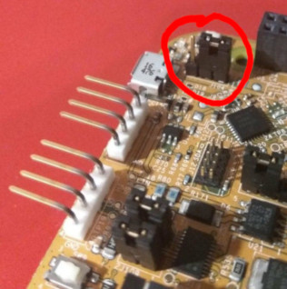

# Flashing the S32K144

The S32K144 holds two MCUs: a Cortex-M4, the target CPU; and a Cortex-M0, the debug CPU.
When we flash a program to the target CPU, the debug CPU exposes a debug application through which the target CPU is flashed via SWD/JTAG.

In this project, we flash our target CPU via a GDB server exposed by [J-Link](https://www.segger.com/downloads/jlink), which expects an OpenSDA debug application.
The debug application can be acquired from [SEGGER's website](https://www.segger.com/downloads/jlink#JLinkOpenSDABoardSpecificFirmwares) (under the FRDM-KL25Z entry, MD5: `f715b2d9db13861a48a86f00f61d2182`) but is also distributed in this repository as `../12_OpenSDA_FRDM-KL25Z.bin` for convenience.

In case your `lsusb`(8) output does not contains the vendor-product-id pair `1366:1015`, you may follow the guide below.

## Flashing the debug application

1. Set jumper J104 to position 1-2 (see figure).
2. Hold RESET switch SW5 on the board down and connect it to a computer via USB.
   The led D2 should start blinking with a frequency of 1Hz.
3. The S32K board should appear as a VFAT mass storage device with the label `BOOTLOADER`.
   Mount the device.
4. Copy `12_OpenSDA_FRDM-KL25Z.bin` to the device.
5. Set jumper J104 back to position 2-3.
6. Power cycle the S32K board while not holding the RESET button down.
7. An USB device with vendor-product-id pair `1366:1015` should appear on the system.
